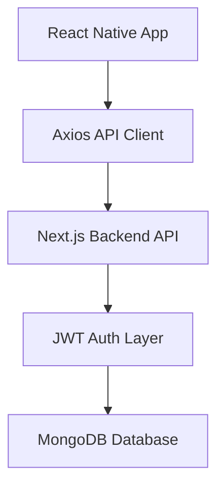

# 🚀 Full Stack Social App (React Native + Next.js + MongoDB)


A **production-ready full-stack mobile application** built with:
- React Native (Mobile)
- Next.js API (Backend)
- MongoDB (Database)
- JWT Authentication

---

# 🧠 Architecture Overview



---

# 📦 Tech Stack

## Backend
- Next.js API Routes
- MongoDB + Mongoose
- JWT Authentication
- bcrypt Password Hashing
- RESTful Architecture

## Mobile App
- React Native (TypeScript)
- React Navigation
- Zustand (State Management)
- Axios (API Layer)
- AsyncStorage (Token Persistence)

---

# 🔐 Authentication Flow

```
User Login/Register
        ↓
Backend returns JWT
        ↓
Store token (AsyncStorage)
        ↓
Attach token to API requests
        ↓
/me validates session
```

---

# 📁 Project Structure

```
/backend
  ├── pages/api
  ├── models
  ├── utils
  ├── controllers

/mobile
  ├── src
      ├── api
      ├── navigation
      ├── screens
      ├── store
      ├── services
```

---

# ⚙️ API Reference

## 🔐 Auth APIs

| Method | Endpoint | Description |
|--------|----------|-------------|
| POST | `/api/auth/register` | Register new user |
| POST | `/api/auth/login` | Login user |
| GET | `/api/me` | Get current user |

---

## 👤 User APIs

| Method | Endpoint | Description |
|--------|----------|-------------|
| PUT | `/api/user/update` | Update user profile |

---

# 📱 Mobile App Screens

| Screen | Description |
|--------|-------------|
| Login | User authentication |
| Register | Create account |
| Home | Main authenticated screen |

---

# 🚀 Setup Instructions

## Backend Setup

```bash
cd backend
npm install
npm run dev
```

Create `.env`:

```
MONGO_URI=your_mongo_uri
JWT_SECRET=your_secret
```

---

## Mobile Setup

```bash
cd mobile
npm install
npx react-native run-android
```

Create `.env`:

```
API_BASE_URL=http://your-api-url/api
```

---

# 🔒 Security Highlights

- JWT-based authentication
- Password hashing with bcrypt
- Protected `/me` endpoint
- Secure token storage on device

---

# 📸 Screenshots

> Add screenshots here once UI is ready

```
/screenshots/login.png
/screenshots/register.png
/screenshots/home.png
```

---

# 📈 Future Improvements

- Refresh token rotation
- Push notifications (FCM)
- Offline support
- Role-based access control
- CI/CD pipeline (GitHub Actions)

---

# 👨‍💻 Developer Notes

This project is designed with **clean architecture principles**:
- Separation of concerns
- Scalable API layer
- Modular frontend structure
- Production-first mindset

---

# 📜 License
MIT
